# Proyecto SQL: Análisis de RR.HH. - Rotación y Desempeño de Empleados

## Resumen
El personal de recursos humanos de **GreatPlaceToWork** desea mejorar el desempeño, aumentar la retención y mejorar la satisfacción laboral general. Sin embargo, no cuentan con una visión clara de los datos pertinentes de los empleados. Mi objetivo es utilizar **SQL** dentro de **Databricks**, analizando sus datos para proporcionar recomendaciones al departamento de RR.HH. que faciliten mejoras exitosas.

## 📩 Si quieres aprender SQL Conéctate conmigo
<p align="center">
  <a href="https://www.linkedin.com/in/jhon-velasque/">
    
  </a>
</p>

## Estructura del Proyecto
- [Sobre los Datos](#sobre-los-datos)
- [Tareas](#tareas-task)
- [Análisis Exploratorio de Datos e Insights](#análisis-exploratorio-de-datos-eda-e-insights)
- [Conclusiones](#conclusiones)

```
Project_HR_Analysis/
├── Data/
│   ├── Employee.csv            -- 1,470 empleados (datos demográficos y laborales)
│   └── PerformanceRating.csv   -- 6,709 evaluaciones de desempeño y satisfacción
├── Picture/                    -- capturas de resultados
├── Scripts/
│   ├── ddl.sql                 -- creación de tablas
│   └── dml.sql                 -- consultas de análisis
└── README.md
```

## Sobre los Datos
Los datos originales, junto con una explicación de cada columna, se pueden encontrar [aquí](https://www.kaggle.com/datasets/mahmoudemadabdallah/hr-analytics-employee-attrition-and-performance/data?select=Employee.csv).

En este proyecto uso dos tablas cargadas en Databricks:

| Tabla | Registros | Columnas clave |
|---|---|---|
| `bd_hr.default.employee` | 1,470 | `EmployeeID`, `Department`, `BusinessTravel`, `DistanceFromHome (KM)`, `OverTime`, `Attrition`, `YearsAtCompany`, `YearsSinceLastPromotion`, `YearsWithCurrManager` |
| `bd_hr.default.performancerating` | 6,709 | `PerformanceID`, `EmployeeID`, `JobSatisfaction`, `TrainingOpportunitiesTaken`, `ManagerRating` |

Ambas tablas se relacionan por `EmployeeID` (un empleado puede tener varias evaluaciones). 190 empleados no tienen evaluación, por lo que no aparecen en las consultas con `JOIN`.

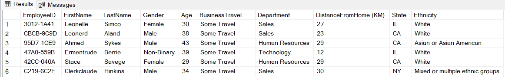

## Tareas (Task)

En este análisis, ayudo al departamento de RR.HH. a responder lo siguiente:

1. **Antigüedad:** ¿Cuál es el promedio de antigüedad de los empleados en cada departamento?
2. **Retención:** ¿Cuántos empleados en cada departamento siguen trabajando actualmente en la empresa?
3. **Satisfacción vs. Antigüedad:** ¿Cómo se compara la satisfacción laboral de los empleados en diferentes niveles de antigüedad?
4. **Horas Extras:** ¿Qué porcentaje de empleados que trabajan horas extras han dejado la empresa?
5. **Desempeño por Viajes:** Clasificar los departamentos por el promedio de calificación de los gerentes, desglosado por frecuencia de viajes de negocios.
6. **Capacitación:** ¿Existe una correlación positiva entre el número de oportunidades de capacitación tomadas y la satisfacción laboral?
7. **Talento Top:** Identificar a los tres mejores empleados según la calificación de su gerente en cada departamento.
8. **Distancia al Trabajo:** Categorizar a los empleados según su distancia al trabajo y mostrar el promedio de satisfacción laboral en cada categoría.
9. **Promociones y Liderazgo:** ¿Existe una relación entre el número de ascensos y los años que un empleado ha pasado con su gerente actual?
10. **Alerta de Rotación:** Para cada departamento, identificar el porcentaje de empleados que se han ido y que tenían una puntuación de satisfacción laboral inferior a 3.

## Análisis Exploratorio de Datos (EDA) e Insights

### Pregunta #1: ¿Cuál es la antigüedad promedio de los empleados en cada departamento?

#### Análisis
Encontré la antigüedad promedio de cada departamento utilizando las funciones `ROUND`, `AVG` y `GROUP BY`. Dado que `YearsAtCompany` ya es un número entero, mantuve el promedio con dos decimales para precisión.

#### Consulta SQL
```sql
SELECT Department
     , ROUND(AVG(YearsAtCompany), 2) AS avg_antiguedad
FROM bd_hr.default.employee
GROUP BY Department
ORDER BY avg_antiguedad DESC;
```
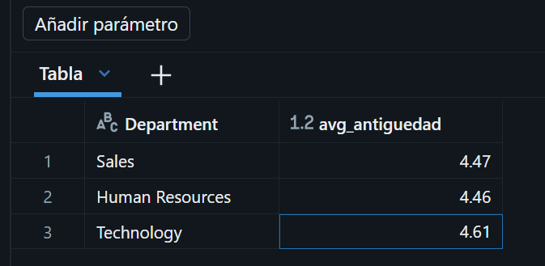

#### Insight
Tecnología tiene la antigüedad más alta con **4.61 años**, seguida de Ventas (**4.47**) y Recursos Humanos (**4.46**). Las diferencias son pequeñas, pero la empresa podría reforzar planes de carrera o mentoría en los departamentos con menor antigüedad.

---

### Pregunta #2: ¿Cuántos empleados en cada departamento siguen trabajando actualmente en la empresa?

#### Análisis
Filtré a los empleados activos con `WHERE Attrition = 'No'`, los conté por departamento con `COUNT` y `GROUP BY`, y calculé su peso sobre el total de activos con la función de ventana `SUM() OVER()`.

#### Consulta SQL
```sql
SELECT Department
     , COUNT(*) AS empleados_activos
     , ROUND(COUNT(*) * 100.0 / SUM(COUNT(*)) OVER (), 0) AS pct_activos
FROM bd_hr.default.employee
WHERE Attrition = 'No'
GROUP BY Department
ORDER BY empleados_activos DESC;
```
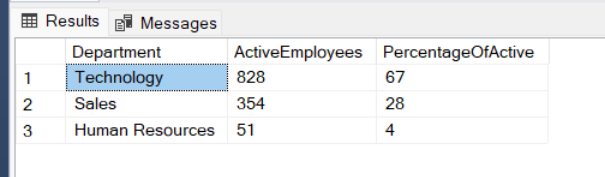

#### Insight
Tecnología concentra **828** empleados activos (**67%**), Ventas **354** (**29%**) y Recursos Humanos solo **51** (**4%**). Conviene revisar la carga de trabajo de RR.HH. y si la atención gerencial en Tecnología alcanza para un equipo tan grande.

---

### Pregunta #3: ¿Cómo se compara la satisfacción laboral de los empleados en diferentes niveles de antigüedad?

#### Análisis
Usé un `CASE` dentro de un `WITH` (CTE) para segmentar la antigüedad en tres grupos (< 3 años, 3-5 años, > 5 años) y un `JOIN` con `performancerating` para obtener el promedio de `JobSatisfaction`.

#### Consulta SQL
```sql
WITH employee_segmentado AS (
    SELECT EmployeeID
         , CASE
               WHEN YearsAtCompany < 3 THEN '< 3 años'
               WHEN YearsAtCompany BETWEEN 3 AND 5 THEN '3-5 años'
               ELSE '> 5 años'
           END AS categoria_antiguedad
    FROM bd_hr.default.employee
)
SELECT e.categoria_antiguedad
     , ROUND(AVG(p.JobSatisfaction), 3) AS avg_satisfaccion
FROM employee_segmentado e
JOIN bd_hr.default.performancerating p ON e.EmployeeID = p.EmployeeID
GROUP BY e.categoria_antiguedad
ORDER BY avg_satisfaccion DESC;
```
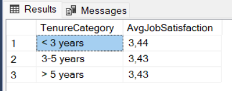

#### Insight
Los empleados con **menos de 3 años** son los más satisfechos (**3.441**), seguidos de 3-5 años (**3.430**) y más de 5 años (**3.427**). La satisfacción baja levemente con el tiempo: reuniones periódicas con los empleados de larga trayectoria ayudarían a entender qué les afecta.

---

### Pregunta #4: ¿Qué porcentaje de empleados que trabajan horas extras han dejado la empresa?

#### Análisis
Agrupé por `OverTime` y con `COUNT_IF` conté a quienes dejaron la empresa (`Attrition = 'Yes'`) dentro de cada grupo. Así el porcentaje se calcula **sobre los que hacen horas extras** y no sobre el total de empleados.

#### Consulta SQL
```sql
SELECT OverTime
     , COUNT(*) AS total_empleados
     , COUNT_IF(Attrition = 'Yes') AS empleados_retirados
     , ROUND(COUNT_IF(Attrition = 'Yes') * 100.0 / COUNT(*), 0) AS pct_rotacion
FROM bd_hr.default.employee
GROUP BY OverTime
ORDER BY OverTime DESC;
```
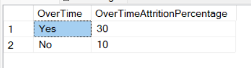

#### Insight
El **31%** de quienes hacen horas extras dejó la empresa, frente a solo el **10%** de quienes no las hacen: triplican la rotación. (Medido sobre el total de empleados, estos retirados equivalen al 8.6%, cifra que esconde el problema.) La empresa debería revisar la compensación de horas extras, flexibilizar horarios y limitar el exceso de tiempo extra.

---

### Pregunta #5: Clasificar los departamentos por el promedio de calificación de los gerentes, desglosado por frecuencia de viajes de negocios.

#### Análisis
Uní ambas tablas con `JOIN`, calculé el `AVG(ManagerRating)` por departamento y tipo de viaje, y usé la función de ventana `RANK() OVER (PARTITION BY BusinessTravel ...)` para clasificar los departamentos dentro de cada tipo de viaje.

#### Consulta SQL
```sql
SELECT e.BusinessTravel
     , e.Department
     , ROUND(AVG(p.ManagerRating), 2) AS avg_manager_rating
     , RANK() OVER (PARTITION BY e.BusinessTravel
                    ORDER BY AVG(p.ManagerRating) DESC) AS ranking
FROM bd_hr.default.employee e
JOIN bd_hr.default.performancerating p ON e.EmployeeID = p.EmployeeID
GROUP BY e.BusinessTravel, e.Department;
```
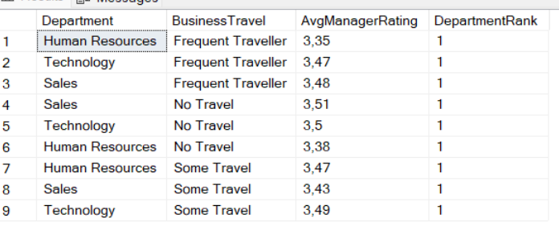

#### Insight
Ventas lidera en *No Travel* (**3.51**) y *Frequent Traveller* (**3.48**), mientras que Tecnología lidera en *Some Travel* (**3.49**). Recursos Humanos queda último en los grupos que no viajan (**3.38**) o viajan frecuentemente (**3.35**). En general, quienes no viajan obtienen mejor calificación (**3.50**) que los que viajan (**3.47**): se recomienda más apoyo a los empleados con mayor carga de viajes.

---

### Pregunta #6: ¿Existe una correlación positiva entre el número de oportunidades de capacitación tomadas y la satisfacción laboral?

#### Análisis
Agrupé las evaluaciones por `TrainingOpportunitiesTaken` y calculé el promedio de `JobSatisfaction`. Además, usé la función `CORR` de Databricks para medir la correlación directamente.

#### Consulta SQL
```sql
SELECT TrainingOpportunitiesTaken
     , COUNT(*) AS evaluaciones
     , ROUND(AVG(JobSatisfaction), 2) AS avg_satisfaccion
FROM bd_hr.default.performancerating
GROUP BY TrainingOpportunitiesTaken
ORDER BY TrainingOpportunitiesTaken;

SELECT ROUND(CORR(TrainingOpportunitiesTaken, JobSatisfaction), 3) AS correlacion
FROM bd_hr.default.performancerating;
```
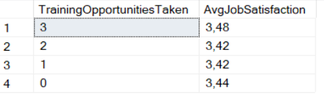

#### Insight
Quienes tomaron **3 capacitaciones** tienen la mayor satisfacción (**3.48**), frente a **3.44** (0), **3.42** (1) y **3.42** (2). La relación es muy débil y no lineal, pero el grupo más capacitado sí destaca: la empresa debería facilitar el acceso a capacitaciones e incentivar la participación.

---

### Pregunta #7: Identificar a los tres mejores empleados según la calificación de su gerente en cada departamento.

#### Análisis
Hay muchos empleados con `ManagerRating = 5` en cada departamento (34 en RR.HH., 196 en Ventas y 479 en Tecnología), así que agregué como criterio de desempate haber tomado 3 capacitaciones y seguir activo. Con `ROW_NUMBER() OVER (PARTITION BY Department ...)` y `RAND()` como último desempate, obtengo un top 3 por departamento.

#### Consulta SQL
```sql
WITH top_performers AS (
    SELECT CONCAT(e.FirstName, ' ', e.LastName) AS nombre_completo
         , e.Department
         , p.ManagerRating
         , p.TrainingOpportunitiesTaken
         , ROW_NUMBER() OVER (PARTITION BY e.Department
                              ORDER BY p.ManagerRating DESC
                                     , p.TrainingOpportunitiesTaken DESC
                                     , RAND()) AS fila
    FROM bd_hr.default.employee e
    JOIN bd_hr.default.performancerating p ON e.EmployeeID = p.EmployeeID
    WHERE p.ManagerRating = 5
      AND p.TrainingOpportunitiesTaken = 3
      AND e.Attrition = 'No'
)
SELECT nombre_completo
     , Department
FROM top_performers
WHERE fila <= 3;
```
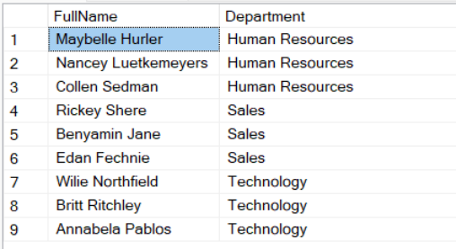

#### Insight
Cada departamento puede identificar a empleados de alto desempeño y comprometidos con su desarrollo. Son buenos candidatos para mentorías, bonos o capacitación financiada por la empresa.

---

### Pregunta #8: Categorizar a los empleados según su distancia al trabajo y mostrar el promedio de satisfacción laboral en cada categoría.

#### Análisis
Primero revisé el rango de distancias con `MIN` y `MAX` (de 1 a 45 KM). Luego segmenté con `CASE` en tres grupos (< 10 KM, 10-30 KM, 30+ KM) y calculé la satisfacción promedio con un `JOIN`.

#### Consulta SQL
```sql
SELECT MIN(`DistanceFromHome (KM)`) AS distancia_min
     , MAX(`DistanceFromHome (KM)`) AS distancia_max
FROM bd_hr.default.employee;

WITH employee_segmentado AS (
    SELECT EmployeeID
         , CASE
               WHEN `DistanceFromHome (KM)` < 10 THEN '< 10 KM'
               WHEN `DistanceFromHome (KM)` BETWEEN 10 AND 30 THEN '10-30 KM'
               ELSE '30+ KM'
           END AS categoria_distancia
    FROM bd_hr.default.employee
)
SELECT e.categoria_distancia
     , COUNT(DISTINCT e.EmployeeID) AS empleados
     , ROUND(AVG(p.JobSatisfaction), 2) AS avg_satisfaccion
FROM employee_segmentado e
JOIN bd_hr.default.performancerating p ON e.EmployeeID = p.EmployeeID
GROUP BY e.categoria_distancia
ORDER BY avg_satisfaccion DESC;
```
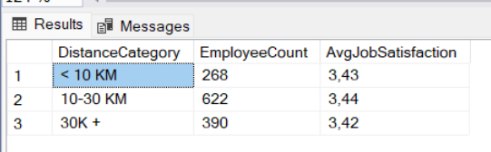

#### Insight
El grupo de **10-30 KM** tiene la mayor satisfacción (**3.44**, 622 empleados), seguido de **< 10 KM** (**3.43**, 268) y **30+ KM** (**3.42**, 390). La distancia influye poco, pero el trabajo híbrido o remoto podría ayudar a quienes viven más lejos.

---

### Pregunta #9: ¿Existe una relación entre el número de ascensos y los años que un empleado ha pasado con su gerente actual?

#### Análisis
Agrupé por `YearsWithCurrManager` y calculé el promedio de `YearsSinceLastPromotion`. También medí la relación con `CORR`.

#### Consulta SQL
```sql
SELECT YearsWithCurrManager
     , COUNT(*) AS empleados
     , ROUND(AVG(YearsSinceLastPromotion), 1) AS avg_anios_sin_ascenso
FROM bd_hr.default.employee
GROUP BY YearsWithCurrManager
ORDER BY YearsWithCurrManager;

SELECT ROUND(CORR(YearsWithCurrManager, YearsSinceLastPromotion), 3) AS correlacion
FROM bd_hr.default.employee;
```
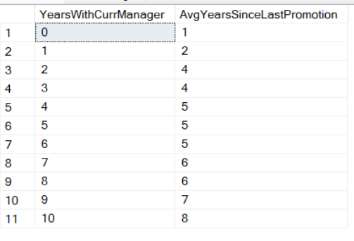

#### Insight
La relación es clara: con **0 años** junto a su gerente, el empleado lleva en promedio **1.5 años** sin ascenso; con **10 años**, lleva **8.8 años**. Cuanto más tiempo con el mismo gerente, más se retrasa el ascenso. Se recomiendan conversaciones de desarrollo periódicas y reconocer a quienes rinden sin cambiar de equipo.

---

### Pregunta #10: Para cada departamento, identificar el porcentaje de empleados que se han ido y que tenían una puntuación de satisfacción laboral inferior a 3.

#### Análisis
Como un empleado tiene varias evaluaciones, primero calculé su satisfacción promedio en un CTE. Luego, con `COUNT_IF`, conté por departamento a los que se fueron con satisfacción < 3, tanto sobre el total de empleados como sobre el total de retirados.

#### Consulta SQL
```sql
WITH satisfaccion_empleado AS (
    SELECT EmployeeID
         , AVG(JobSatisfaction) AS avg_satisfaccion
    FROM bd_hr.default.performancerating
    GROUP BY EmployeeID
)
SELECT e.Department
     , COUNT_IF(e.Attrition = 'Yes') AS retirados
     , ROUND(COUNT_IF(e.Attrition = 'Yes' AND s.avg_satisfaccion < 3) * 100.0
             / COUNT(*), 2) AS pct_sobre_total
     , ROUND(COUNT_IF(e.Attrition = 'Yes' AND s.avg_satisfaccion < 3) * 100.0
             / COUNT_IF(e.Attrition = 'Yes'), 2) AS pct_sobre_retirados
FROM bd_hr.default.employee e
JOIN satisfaccion_empleado s ON e.EmployeeID = s.EmployeeID
GROUP BY e.Department
ORDER BY pct_sobre_retirados DESC;
```
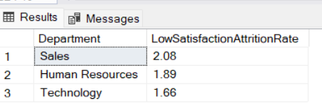

#### Insight
Entre los empleados que se fueron, Tecnología tiene el mayor porcentaje con baja satisfacción (**10.53%**), seguida de Ventas (**8.70%**) y RR.HH. (**8.33%**). Sobre el total de cada departamento la cifra no supera el **2.1%**: la baja satisfacción explica solo una parte pequeña de la rotación, por lo que factores como las horas extras (Pregunta #4) pesan más.

## Conclusiones
- **Horas extras** es el principal factor de rotación: 31% de rotación frente a 10%.
- **Tecnología** concentra dos tercios de la plantilla y la mayor proporción de retirados insatisfechos.
- **Permanecer mucho tiempo con el mismo gerente** se asocia a ascensos más tardíos.
- **Capacitación, distancia y antigüedad** tienen un efecto leve sobre la satisfacción.
